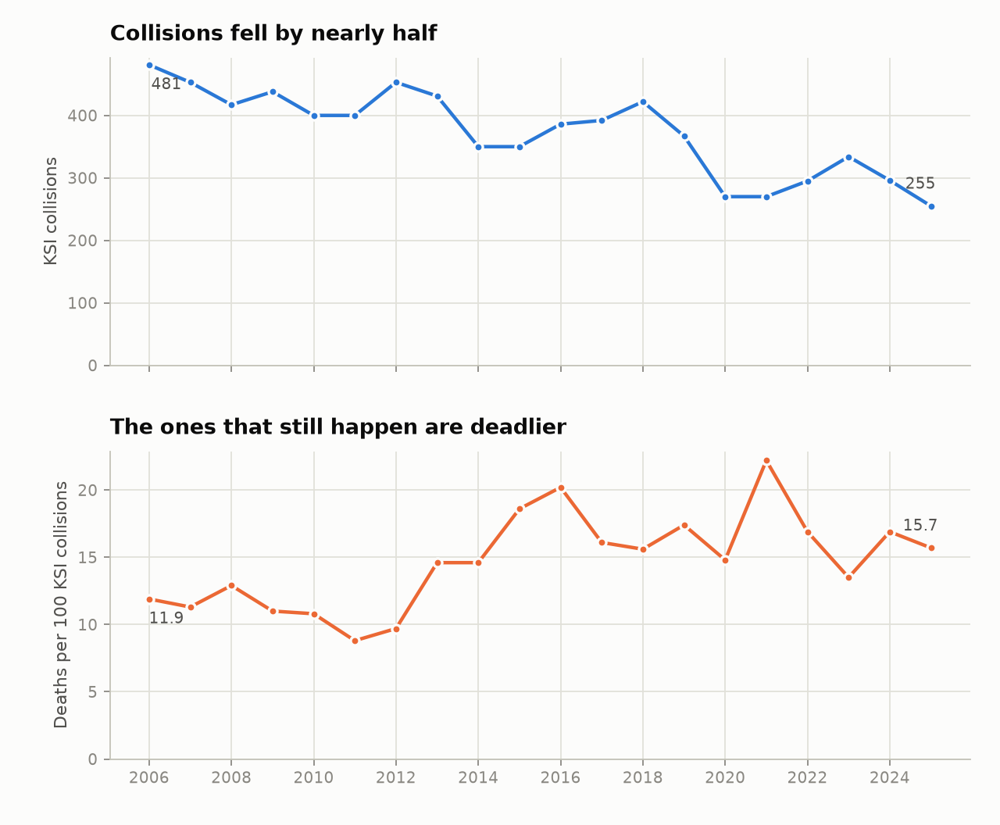
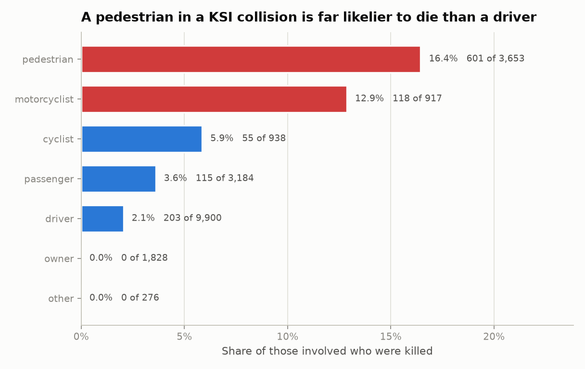
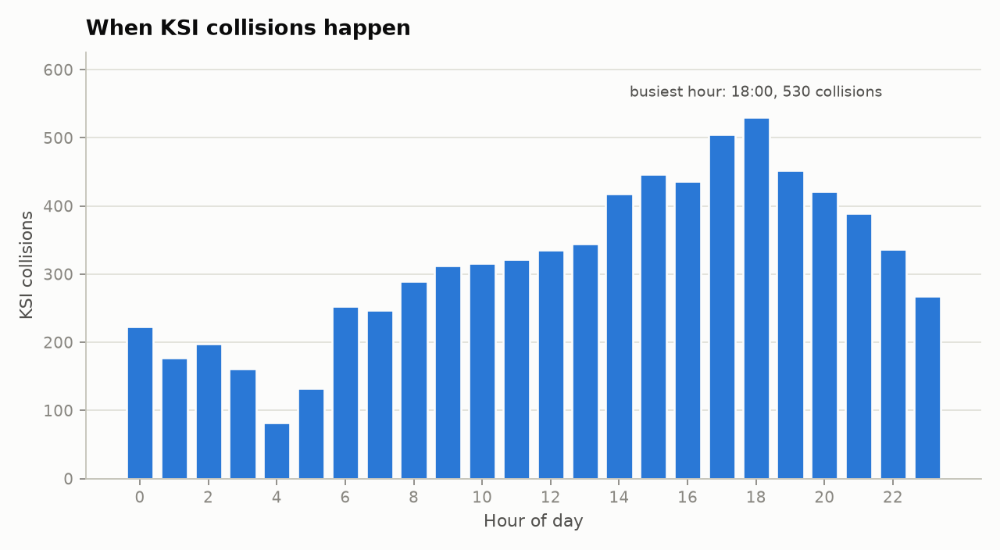
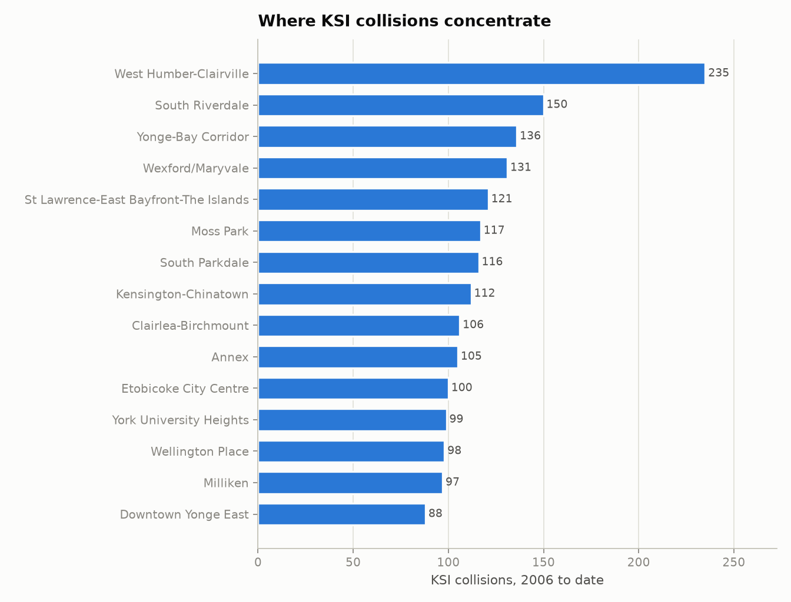

# Toronto Killed or Seriously Injured Collisions

*What the data says once you know what a row is  |  Niloufar Rahmani  |  Source: City of Toronto Open Data, retrieved 2026-09-07  |  20,715 person records across 7,596 collisions*

## 1. What one row is

> The file has one row per person involved in a collision, not one row per collision. The average collision involves 2.7 people. Counting rows therefore overstates every collision-level figure by roughly that factor, and the error is invisible — the numbers look plausible.

This was not assumed from the column names. Every column was tested: for each one, does its value ever differ between two people in the same collision? 30 columns never vary within a collision, which makes them facts about the collision copied onto each person row. 16 columns do vary, which makes them facts about the person. Four are identifiers.

The consequence is not academic. `acclass`, the severity of the collision, is one of the collision-level columns. Filtering rows on it and counting them answers neither of the two questions a reader would be asking.

| question | naive method | naive answer | correct method | correct answer | overstated by |
|---|---|---|---|---|---|
| How many KSI collisions are in this file? | count of rows | 20715 | count of distinct collision_id | 7596 | 2.73 |
| How many collisions were fatal? | count of rows where acclass = 'Fatal Injury' | 2927 | distinct collision_id where acclass = 'Fatal Injury' | 1061 | 2.76 |
| How many people were killed? | count of rows where acclass = 'Fatal Injury' | 2927 | count of rows where injury = 'Fatal' | 1094 | 2.68 |
| How many people were seriously injured? | count of rows where acclass = 'Non-Fatal Injury' | 17769 | count of rows where injury = 'Major' | 7103 | 2.5 |
| How many collisions involving a pedestrian? | count of rows where pedestrian is true | 8451 | distinct collision_id where pedestrian is true | 3393 | 2.49 |
| How many collisions involving a cyclist? | count of rows where cyclist is true | 2158 | distinct collision_id where cyclist is true | 923 | 2.34 |
| How many collisions flagged aggressive driving? | count of rows where aggressive is true | 9257 | distinct collision_id where aggressive is true | 3164 | 2.93 |
| How many collisions flagged distracted driving? | count of rows where distracted is true | 6228 | distinct collision_id where distracted is true | 2244 | 2.78 |
| How many collisions flagged red-light running? | count of rows where red_light is true | 1693 | distinct collision_id where red_light is true | 473 | 3.58 |
| How many collisions involving a heavy truck? | count of rows where heavy_truck is true | 2792 | distinct collision_id where heavy_truck is true | 930 | 3.0 |
| How many collisions flagged school child? | count of rows where school_child is true | 4074 | distinct collision_id where school_child is true | 1094 | 3.72 |
| How many collisions flagged older adult? | count of rows where older_adult is true | 6007 | distinct collision_id where older_adult is true | 2166 | 2.77 |

The two correct answers in the third row are different from each other and both are right: 1,061 collisions were fatal, and 1,094 people died in them. The gap is the collisions that killed more than one person, plus 6 records discussed in section 2. Which number belongs in a headline depends on whether the sentence is about crashes or about people, and that is a decision to make deliberately rather than by accident of query.

The same trap sits under the word pedestrian. Collisions involving a pedestrian: 3,393. People present in those collisions: 8,451. Pedestrians actually involved: 3,653. Pedestrians killed: 601. All four are legitimate answers to questions that sound identical when spoken aloud.

## 2. Data quality

Rules were run against the extract exactly as published. The dataset is in good condition; the failures below are small, and they are recorded because a consumer needs to know about them before quoting a number, not as a criticism of the publisher.

| dimension | rule | records failed | share failed | outcome | impact |
|---|---|---|---|---|---|
| Uniqueness | one row per (collision, vehicle, person) | 0 | 0.0 | Pass | Confirms the stated grain. Nothing downstream is safe without it. |
| Completeness | acclass is populated | 1 | 5e-05 | Fail | A row with no severity class cannot be counted as fatal or non-fatal. |
| Completeness | coordinates are populated | 3 | 0.00014 | Fail | Rows without coordinates drop silently out of any map or spatial join. |
| Completeness | neighbourhood is populated | 151 | 0.00729 | Fail | Affects the neighbourhood ranking, which is built on this column. |
| Validity | coordinates fall inside Toronto | 0 | 0.0 | Pass | No coordinate lands outside the city, so the geography can be trusted. |
| Validity | acclass uses a known severity code | 0 | 0.0 | Pass | An unrecognised code would fall through every severity filter. |
| Validity | injury uses a known severity code | 0 | 0.0 | Pass | Same risk on the person-level severity column. |
| Consistency | a fatal injury sits in a collision classed fatal | 6 | 0.00029 | Fail | The two severity columns disagree, so the death count and the fatal collision count cannot both be right on these rows. |
| Consistency | a collision classed fatal records at least one death | 0 | 0.0 | Pass | Confirms the fatal classification is supported by a person record. |
| Scope | every record meets the killed-or-seriously-injured criterion | 18 | 0.00087 | Fail | Records classed property damage only do not belong in a KSI extract and will inflate any unfiltered collision count. |

- 6 person records are marked injury = 'Fatal' while their collision is not classed 'Fatal Injury'. This is why the death count (1 per person record) and the fatal collision count do not reconcile to each other exactly, and the difference is precisely these rows.
- 18 person records across 8 collisions are classed 'Property Damage Only' in an extract published as killed-or-seriously-injured. They are kept in the figures here and flagged rather than dropped, because removing records from a public dataset without saying so is how two analysts end up with different totals.
- injury is missing on 47% of rows, which is expected: it is populated only where there was an injury to record. The consequence is that severity has to be counted with an equality test, never with count() or a row count.

## 3. Twenty years of KSI collisions

2006 to 2025. The final year in the extract is partial and is excluded from every trend in this report rather than plotted as a collapse.

*KSI collisions per year, and deaths per 100 KSI collisions.*

> KSI collisions fell 47% between 2006 and 2025, from 481 to 255. Deaths per 100 KSI collisions moved the other way, from 11.9 to 15.7. Fewer collisions reach this threshold than twenty years ago, and a larger share of the ones that do are fatal.

Two readings fit that pattern and this data cannot separate them. Either the collisions being prevented are disproportionately the survivable ones, or the reporting threshold for a serious injury has tightened over twenty years so that fewer non-fatal cases enter the file. A fatality is hard to misclassify; a serious injury is a judgement. Anyone using this trend to argue that roads have become more lethal per collision needs to rule the second explanation out first, and nothing in this extract does that.

| year | ksi collisions | fatal collisions | people involved | people killed | people seriously injured | deaths per 100 collisions |
|---|---|---|---|---|---|---|
| 2006.0 | 481.0 | 57.0 | 1483.0 | 57.0 | 488.0 | 11.9 |
| 2007.0 | 453.0 | 47.0 | 1474.0 | 51.0 | 442.0 | 11.3 |
| 2008.0 | 417.0 | 51.0 | 1239.0 | 54.0 | 394.0 | 12.9 |
| 2009.0 | 438.0 | 45.0 | 1242.0 | 48.0 | 431.0 | 11.0 |
| 2010.0 | 400.0 | 42.0 | 1190.0 | 43.0 | 402.0 | 10.8 |
| 2011.0 | 400.0 | 35.0 | 1181.0 | 35.0 | 392.0 | 8.8 |
| 2012.0 | 453.0 | 44.0 | 1348.0 | 44.0 | 430.0 | 9.7 |
| 2013.0 | 431.0 | 63.0 | 1232.0 | 63.0 | 401.0 | 14.6 |
| 2014.0 | 350.0 | 51.0 | 916.0 | 51.0 | 330.0 | 14.6 |
| 2015.0 | 350.0 | 65.0 | 929.0 | 65.0 | 320.0 | 18.6 |
| 2016.0 | 386.0 | 76.0 | 1006.0 | 78.0 | 337.0 | 20.2 |
| 2017.0 | 392.0 | 62.0 | 980.0 | 63.0 | 352.0 | 16.1 |
| 2018.0 | 422.0 | 66.0 | 1074.0 | 66.0 | 382.0 | 15.6 |
| 2019.0 | 367.0 | 63.0 | 940.0 | 64.0 | 330.0 | 17.4 |
| 2020.0 | 270.0 | 40.0 | 640.0 | 40.0 | 246.0 | 14.8 |
| 2021.0 | 270.0 | 58.0 | 656.0 | 60.0 | 241.0 | 22.2 |
| 2022.0 | 295.0 | 48.0 | 730.0 | 50.0 | 264.0 | 16.9 |
| 2023.0 | 334.0 | 43.0 | 770.0 | 45.0 | 301.0 | 13.5 |
| 2024.0 | 296.0 | 46.0 | 725.0 | 50.0 | 266.0 | 16.9 |
| 2025.0 | 255.0 | 34.0 | 618.0 | 40.0 | 233.0 | 15.7 |

## 4. Who is being killed

This is a person-level question, so it is answered from the person rows. The rate below is the share of people involved, in that role, who died.

*Fatality rate by road user.*

A pedestrian involved in a KSI collision dies 8 times as often as a driver involved in one (16.4% against 2.1%). Pedestrians are 601 of the 1,094 people killed in the whole extract — 55% of deaths — while making up 18% of the people involved.

| road user | people involved | killed | seriously injured | fatality rate |
|---|---|---|---|---|
| pedestrian | 3653 | 601 | 2841 | 0.1645 |
| motorcyclist | 917 | 118 | 730 | 0.1287 |
| cyclist | 938 | 55 | 838 | 0.0586 |
| passenger | 3184 | 115 | 859 | 0.0361 |
| driver | 9900 | 203 | 1817 | 0.0205 |
| owner | 1828 | 0 | 0 | 0.0 |
| other | 276 | 0 | 1 | 0.0 |

The `owner` row is a data artefact rather than a finding: it records the registered owner of a vehicle, who is frequently not present, which is why the category shows zero injuries of any kind. It is left in the table so the totals reconcile.

## 5. When and where

*KSI collisions by hour of day.*

*The 15 neighbourhoods with the most KSI collisions.*

The neighbourhood ranking is deliberately reported as counts and not as a risk rate. A rate needs a denominator this file does not contain — resident population, or better, vehicle and pedestrian kilometres travelled through the area. Dividing by neither produces a ranking that largely reflects how busy a place is, which is worth knowing but is not the same as how dangerous it is. Treating this list as a danger ranking would be the second-biggest error available in this dataset, after the one in section 1.

| neighbourhood | ksi collisions | fatal collisions | fatal share |
|---|---|---|---|
| West Humber-Clairville | 235 | 37 | 0.1574 |
| South Riverdale | 150 | 13 | 0.0867 |
| Yonge-Bay Corridor | 136 | 9 | 0.0662 |
| Wexford/Maryvale | 131 | 28 | 0.2137 |
| St Lawrence-East Bayfront-The Islands | 121 | 15 | 0.124 |
| Moss Park | 117 | 14 | 0.1197 |
| South Parkdale | 116 | 26 | 0.2241 |
| Kensington-Chinatown | 112 | 14 | 0.125 |
| Clairlea-Birchmount | 106 | 21 | 0.1981 |
| Annex | 105 | 9 | 0.0857 |
| Etobicoke City Centre | 100 | 17 | 0.17 |
| York University Heights | 99 | 15 | 0.1515 |
| Wellington Place | 98 | 5 | 0.051 |
| Milliken | 97 | 15 | 0.1546 |
| Downtown Yonge East | 88 | 7 | 0.0795 |

## 6. Circumstances

Each flag is a collision-level attribute, so these are collision counts. The final column compares the fatal share of flagged collisions against the fatal share of all KSI collisions.

| flag | collisions | share of collisions | fatal share | vs baseline |
|---|---|---|---|---|
| pedestrian | 3393 | 0.4467 | 0.1751 | 1.25 |
| aggressive | 3164 | 0.4165 | 0.1229 | 0.88 |
| distracted | 2244 | 0.2954 | 0.1176 | 0.84 |
| older_adult | 2166 | 0.2852 | 0.2031 | 1.45 |
| school_child | 1094 | 0.144 | 0.1216 | 0.87 |
| heavy_truck | 930 | 0.1224 | 0.2409 | 1.72 |
| cyclist | 923 | 0.1215 | 0.0585 | 0.42 |
| motorcyclist | 856 | 0.1127 | 0.1367 | 0.98 |
| red_light | 473 | 0.0623 | 0.1226 | 0.88 |

These are associations in a file that only contains collisions serious enough to be recorded. Every rate here is conditional on a KSI collision having already happened, so none of them is the risk of anything. A flag with a high fatal share tells you which collisions turn out worst once they occur; it does not tell you what causes them or how often they occur.

## 7. What this analysis cannot tell you

- There is no exposure denominator. Without population, traffic volume or distance travelled, no count here can become a risk rate, and none is presented as one.
- The file contains only collisions where someone was killed or seriously injured. It cannot say anything about collisions in general, or about how often a given circumstance leads to a collision.
- Serious injury is a reported judgement and its threshold may have shifted over twenty years. This directly affects the section 3 trend.
- The circumstance flags are assigned by the reporting officer. They record what was recorded, not what happened.
- The extract is refreshed daily and figures move as historical records are amended. Everything here was computed from the snapshot identified in section 8.
- Association is not cause. Nothing in this report supports a causal claim, and none is made.

## 8. Reproducing this

The extract is refreshed daily, so the exact copy behind these numbers is recorded rather than described. Rerun `python run.py` against the current file and compare the snapshot to see precisely what changed.

| field | value |
|---|---|
| package | motor-vehicle-collisions-involving-killed-or-seriously-injured-persons |
| retrieved_utc | 2026-09-07T12:32:52Z |
| sha256 | 253b04501009c6a5004fb5a11de5bcf85d2aa8bf8a8ed5ff44a1bfe0af3d8365 |
| person_rows | 20715 |
| collisions | 7596 |
| columns | 50 |
| earliest_collision | 2006-01-01 |
| latest_collision | 2026-08-28 |

Source: City of Toronto Open Data Portal, Motor Vehicle Collisions Involving Killed or Seriously Injured Persons. Retrieved over the public CKAN API with no key or account. The data is published by Toronto Police Service and covers the City of Toronto only.
